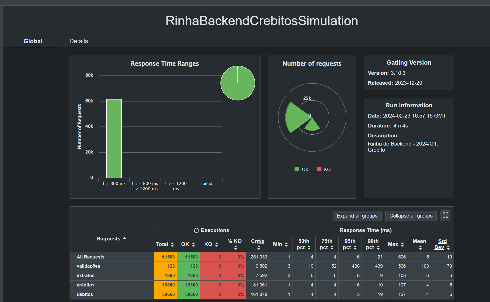
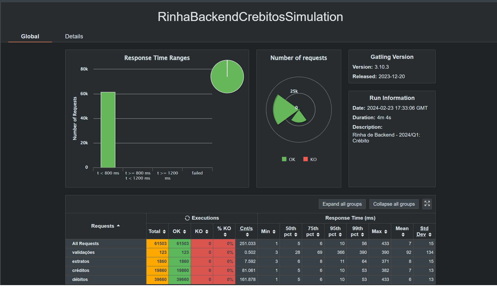

# Rinha de Backend - Segunda Edição

Meu segundo repositório na rinha. O primeiro foi feito em .net 8.0 e pode ser encontrado [aqui](https://github.com/felipebossolani/rinha-de-backend-2024-q01-dotnet). Esse código replica bem o primeiro porém aplicando a versão preview 1 do .net 9.0 e tentando colocar algumas melhorias e vermos como fica. O desafio é [rinha de backend 2ª edição - 2024/Q1](https://github.com/zanfranceschi/rinha-de-backend-2024-q1).
Imagem da versão da api em .net 9.0 pode ser encontrada [aqui](https://hub.docker.com/r/felipebossolani/rinha-de-backend-2024-q01-dotnet9-preview) está com 49.25Mb. 

## Stack

- .net 9.0 preview 1
- nginx
- postgres

## Rodando o projeto

```bash
docker-compose up -d
```

## Resultados

### Resultados do gatling referente a primeira execução com imagem local


### Resultados do gatling referente a primeira execução com imagem no docker hub

